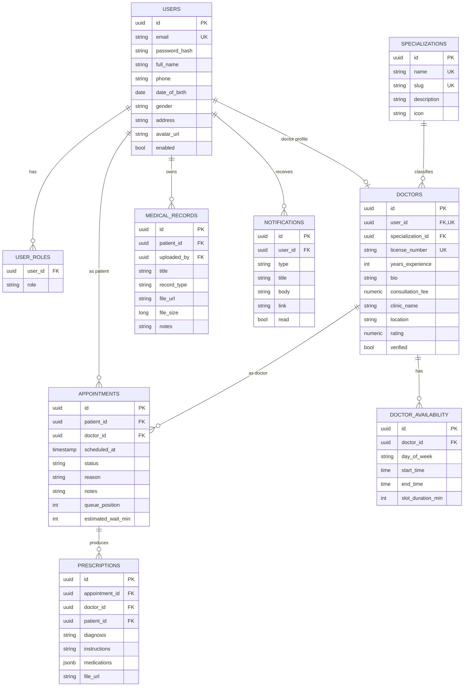

# HealTime — Entity Relationship Diagram

```mermaid
erDiagram
    USERS ||--o{ USER_ROLES : has
    USERS ||--o| DOCTORS : "doctor profile"
    USERS ||--o{ APPOINTMENTS : "as patient"
    DOCTORS ||--o{ APPOINTMENTS : "as doctor"
    DOCTORS ||--o{ DOCTOR_AVAILABILITY : has
    SPECIALIZATIONS ||--o{ DOCTORS : classifies
    APPOINTMENTS ||--o{ PRESCRIPTIONS : produces
    USERS ||--o{ MEDICAL_RECORDS : owns
    USERS ||--o{ NOTIFICATIONS : receives

    USERS {
      uuid id PK
      string email UK
      string password_hash
      string full_name
      string phone
      date date_of_birth
      string gender
      string address
      string avatar_url
      bool enabled
    }
    USER_ROLES {
      uuid user_id FK
      string role
    }
    SPECIALIZATIONS {
      uuid id PK
      string name UK
      string slug UK
      string description
      string icon
    }
    DOCTORS {
      uuid id PK
      uuid user_id FK,UK
      uuid specialization_id FK
      string license_number UK
      int years_experience
      string bio
      numeric consultation_fee
      string clinic_name
      string location
      numeric rating
      bool verified
    }
    DOCTOR_AVAILABILITY {
      uuid id PK
      uuid doctor_id FK
      string day_of_week
      time start_time
      time end_time
      int slot_duration_min
    }
    APPOINTMENTS {
      uuid id PK
      uuid patient_id FK
      uuid doctor_id FK
      timestamp scheduled_at
      string status
      string reason
      string notes
      int queue_position
      int estimated_wait_min
    }
    MEDICAL_RECORDS {
      uuid id PK
      uuid patient_id FK
      uuid uploaded_by FK
      string title
      string record_type
      string file_url
      long file_size
      string notes
    }
    PRESCRIPTIONS {
      uuid id PK
      uuid appointment_id FK
      uuid doctor_id FK
      uuid patient_id FK
      string diagnosis
      string instructions
      jsonb medications
      string file_url
    }
    NOTIFICATIONS {
      uuid id PK
      uuid user_id FK
      string type
      string title
      string body
      string link
      bool read
    }
```
